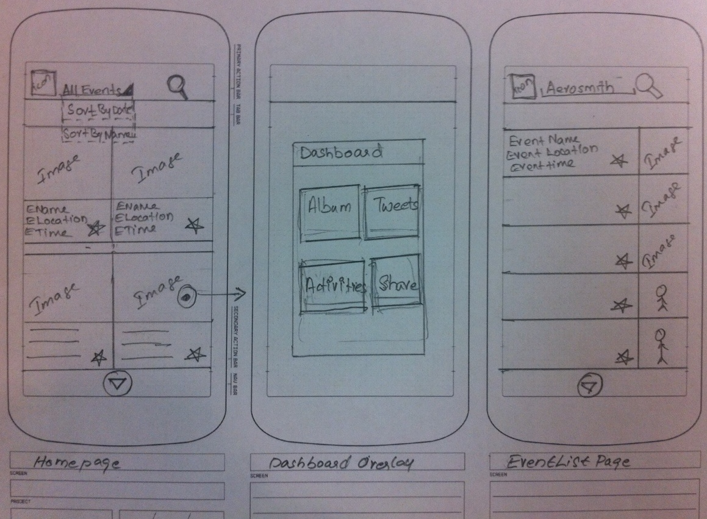
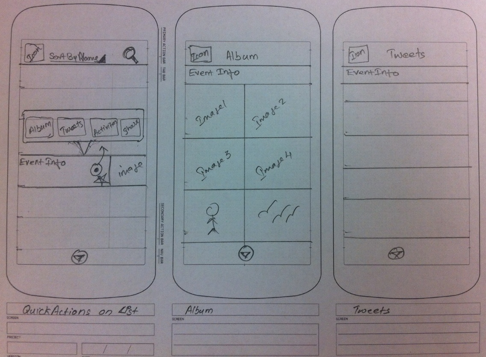
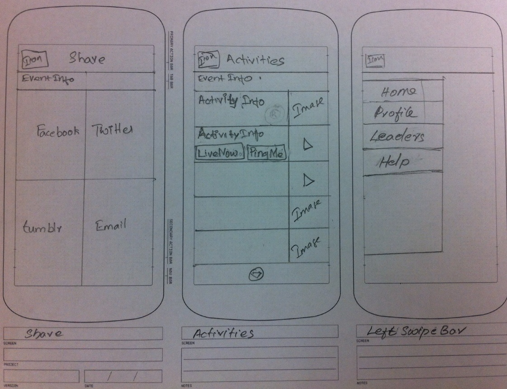
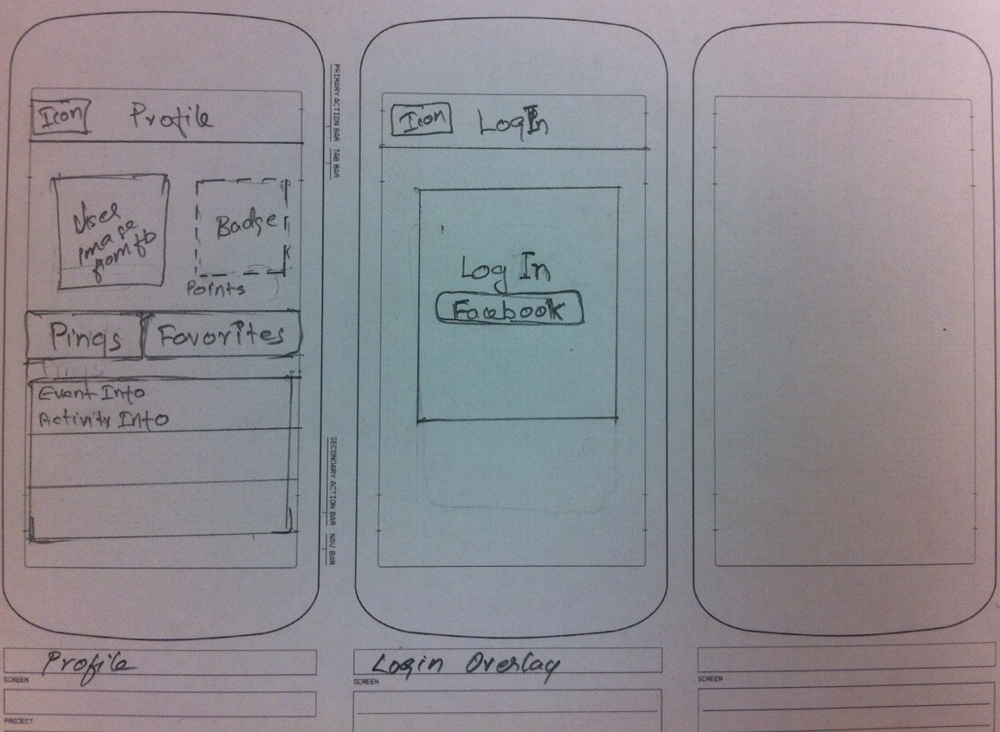

LiveDash
========

Highlevel User stories:

 * [x] Users could view pictures and tweets of live event.
 * [x] Users could notify other viewers on specific LIVE event activities.
 * [x] Users cold get notifications on upcoming event Activities.
 * [x] Leader board and badges for active users.
 * [x] Wireframe details.

  * Homepage 
  * --Displays all top live events.
  * --Dashboard to quickly navigate to specific actions
  * --Search for specific event from the list
  * Sort 
  * -- Sorting event list by name and date.
  * QuickActions
  * -- Take user to event specific actions from the event list(search or sort resultset).
  * Share 
  * -- Navigate user to share event page to thirdparty social medium.
  * Album
  * -- Displays picture of live show from web
  * Tweets
  * -- Tweets of the live event
  * Activities 
  * -- User could ping(LIVE NOW button) other live event viewers about specific activity and collect points.Also user could set reminder(PING ME button) to specific activities to get notification from other users.
  * LeftNavMenu 
  * -- This is for quick navigation to user profile,favorite events and help.A Leader board to promote users.
  * Profile 
  * -- Displays your reminders(pings) and favorite events.Picture from FB and Badge for n points accumulated.
  * LogIn 
  * -- Profile management using FB credentials.

NOTES
=======

backend: `http://video.stage.media.yql.yahoo.com/v1/video/events?dev_type=int`
